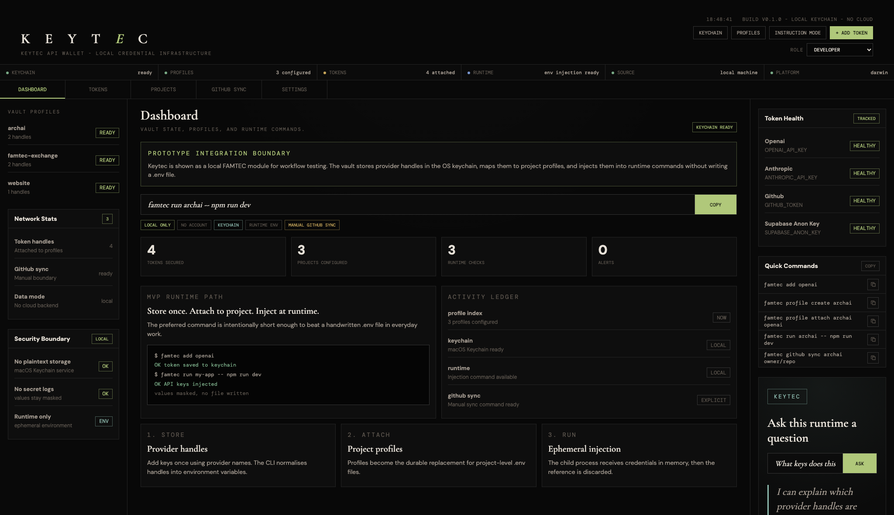
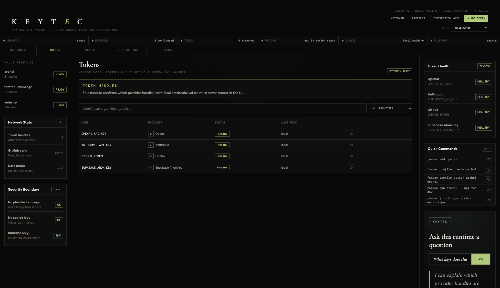
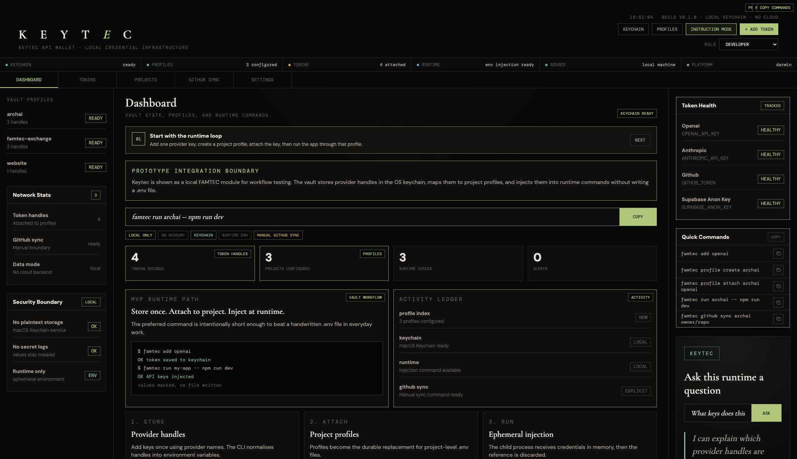
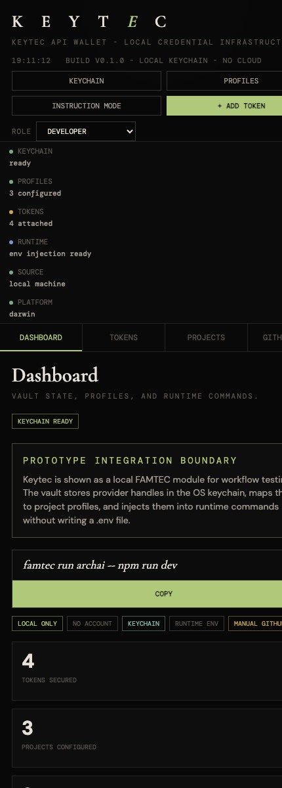

# Keytec API Wallet

Local-first API credential vault and runtime injection for developers.

Store once. Inject at runtime. Never expose.

## Screenshots

### Dashboard



### Token Handles



### Instruction Mode



### Mobile Preview



## MVP

This prototype implements the core CLI workflow:

- Store API keys in macOS Keychain.
- Group keys into local project profiles.
- Inject profile keys into a child process environment.
- Mask values in debug output.
- Sync profile values to GitHub Actions Secrets through the GitHub CLI.

No cloud backend or login is required.

## Install For Local Development

```sh
npm install
npm link
```

The checked-in `bin/famtec.js` can also be run directly:

```sh
node bin/famtec.js help
```

## Core Workflow

```sh
famtec add openai
famtec profile create my-app
famtec profile attach my-app openai
famtec run my-app -- npm run dev
```

The `--` delimiter is recommended because it makes the boundary between Keytec/FAMTEC arguments and your application command explicit. `famtec run my-app npm run dev` is also accepted for quick use.

Provider names are normalized to environment variable names. For example:

- `openai` becomes `OPENAI_API_KEY`
- `anthropic` becomes `ANTHROPIC_API_KEY`
- `GITHUB_TOKEN` stays `GITHUB_TOKEN`

## Commands

```sh
famtec add <provider>
famtec get <provider>
famtec remove <provider>

famtec profile create <name>
famtec profile attach <name> <provider>
famtec profile list

famtec run <profile> -- <command>
famtec env <profile>

famtec github connect
famtec github sync <profile> owner/repo
```

`famtec get` and `famtec env` mask values by default. Use `famtec get <provider> --show` only when you intentionally need to reveal a secret.

Avoid passing secrets directly as shell arguments. Interactive prompts, stdin, and provider-native token rotation workflows are preferred because shell history lasts longer than anyone expects.

## Security Model

Secrets are stored with:

```text
service: famtec
account: <ENV_VAR_NAME>
```

Profile metadata is stored in `~/.famtec/profiles.json`. This file contains provider names only, never secret values.

Runtime injection uses `child_process.spawn` with an augmented environment for the child process. Secret references are deleted from the local environment object after the command exits.

## GitHub Sync

GitHub sync requires the GitHub CLI:

```sh
brew install gh
```

Then store a fine-grained token:

```sh
famtec github connect
famtec github sync my-app owner/repo
```

The token should have permission to write repository Actions secrets.

## Local Browser App

Build the dockable macOS browser wrapper with:

```sh
./scripts/build_macos_browser_app.sh "/Users/robgraham/Desktop/APPS/Keytec API Wallet"
```

The app name is taken from the destination folder. For example, building into `/Users/robgraham/Desktop/APPS/Keytec API Wallet` creates `Keytec API Wallet.app`, starts a localhost-only dashboard, and opens it in a Chrome app window.

See [KEYTEC_API_WALLET_BUILD.md](./KEYTEC_API_WALLET_BUILD.md) for the complete prototype build notes, security model, app wrapper details, and verification commands.

## OpenClaw Boundary

OpenClaw support and onboarding systems must not access vault contents, call Keychain APIs, or receive raw environment values. Only sanitized CLI errors, usage events, and documentation content are allowed.

## Rights Notice

Copyright (c) 2026 Rob Graham.
All rights reserved.

This repository is published for authorship, visibility, and evaluation purposes only. No permission is granted to use, copy, modify, distribute, sublicense, sell, or create derivative works from this code, documentation, screenshots, or associated materials without prior written permission from Rob Graham.

Website: [fineartmedia.tech](https://fineartmedia.tech)

Contact: [rob@fineartmedia.tech](mailto:rob@fineartmedia.tech)
